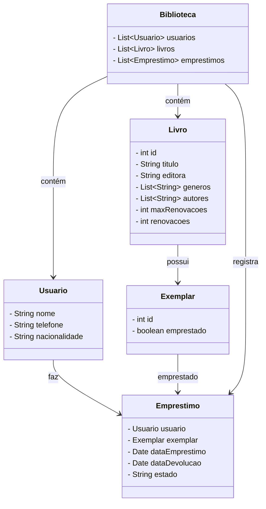

# Modelagem de Dados de uma Biblioteca

```mermaid
classDiagram
class Usuario {
  - String nome
  - String telefone
  - String nacionalidade
}

    class Livro {
        - int id
        - String titulo
        - String editora
        - List~String~ generos
        - List~String~ autores
        - int maxRenovacoes
        - int renovacoes
    }

    class Exemplar {
        - int id
        - boolean emprestado
    }

    class Emprestimo {
        - Usuario usuario
        - Exemplar exemplar
        - Date dataEmprestimo
        - Date dataDevolucao
        - String estado
    }

    class Biblioteca {
        - List~Usuario~ usuarios
        - List~Livro~ livros
        - List~Emprestimo~ emprestimos
    }

    Usuario --> Emprestimo : faz
    Livro --> Exemplar : possui
    Exemplar --> Emprestimo : emprestado
    Biblioteca --> Usuario : contém
    Biblioteca --> Livro : contém
    Biblioteca --> Emprestimo : registra
```
